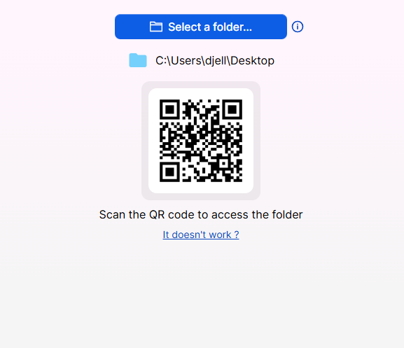

# Izy Transfer
Izy Transfer is a desktop application for Windows and Mac that makes file transfer easier over local network. Share files between your computer and any device connected to the same network.

# How it works

Launch the desktop application and select the folder from which you want to download or upload files.

Scan the QR code with the device you want to share files with. A web page will open with two tabs: Send and Download. 

To send files, click on the Send tab, then click on Select Files. A Send Files button will appear in the bottom of the page. Click on it and follow the transfer in the desktop application window.

To download files, click on the Download tab. All files present in the selected folder of the desktop application will be displayed. Check the files you want to download. A Download Files button will appear in the bottom of the page. Click on it and follow the transfer in the desktop application window.

